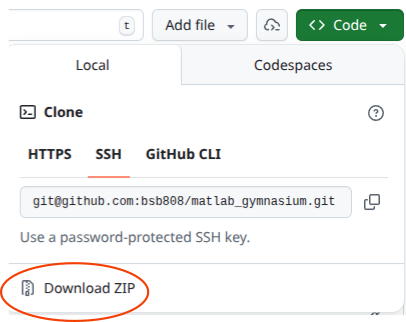

# Blackjack

## Overview

This example illustrates using reinforcement learning (RL), specifically Q-Learning, to learn a policy to play the casino card game blackjack.  The purpose of the example is to provide minimal working example to illustrate the implementation of a Q-learning strategy.

The MATLAB implementation is intentionally procedural and specific, limiting the use of objects and avoiding the Mathworks RL toolbox, to allow folks new to RL to experiment efficiently without the need to learn specific frameworks.

*Attribution*: Adapted from the Farama Foundation's Gymnasium tutoral, [Solving Blackjack with Q-Learning](https://gymnasium.farama.org/tutorials/training_agents/blackjack_tutorial/).  
The custom blackjack environmet is based on the Gymnasium [blackjack.py](https://github.com/Farama-Foundation/Gymnasium/blob/main/gymnasium/envs/toy_text/blackjack.py) environment, but is implementd as a standalone MATLAB class.

## Getting Started

1. Download (or clone) the repository locally.  All the examples require the [BlackJackEnv.m](BlackJackEnv.m) be in the MATLAB's `Current Folder` or added to the path to generate the blackjack game environment.  To download the repository, go to the [main repository page](https://github.com/bsb808/matlab_gymnasium), click on the "Code" button and select "Download ZIP"

2. Start with the [blackjack_intro.mlx](blackjack_intro.mlx) live script which provides a tour of the blackjack interface and illustrates playing a game manually.
3. The [blackjack_qulearning.mlx](blackjack_qulearning.mlx) live script parallels the  [Solving Blackjack with Q-Learning](https://gymnasium.farama.org/tutorials/training_agents/blackjack_tutorial/) as a demonstration of implementing Q-Learning.  (Because live scripts are unfortunately still stored as binary files, a pdf export of the qlearning example is included for viewing without MATLAB: [blackjack_qulearning.pdf](blackjack_qulearning.pdf).)
